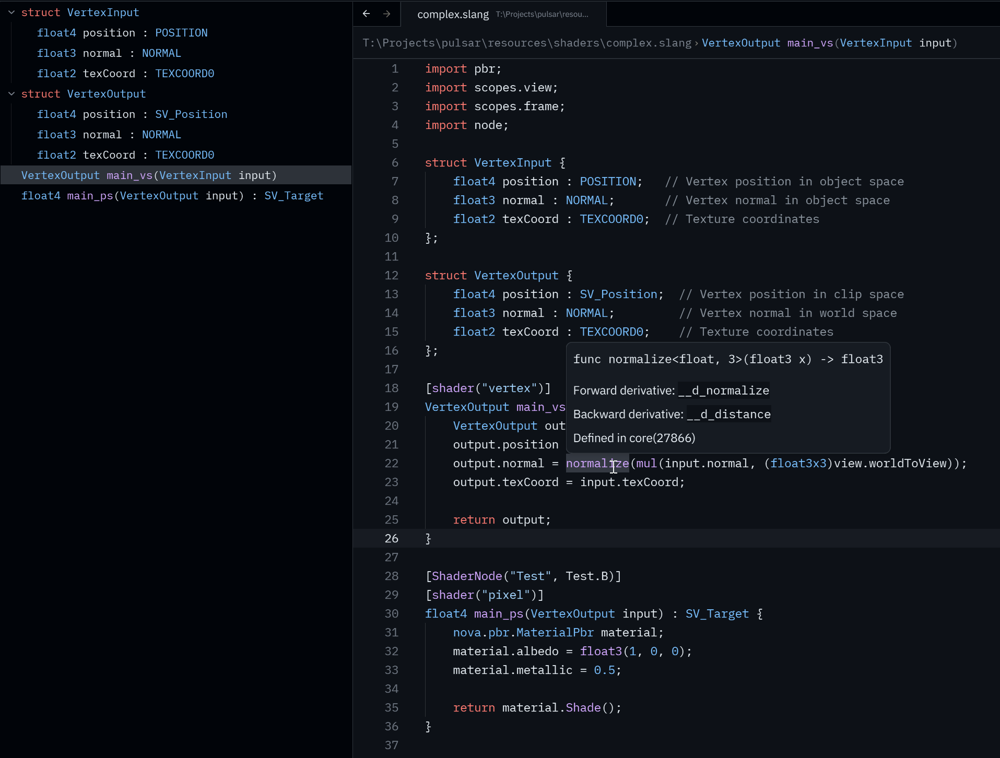

# Slang support for Zed

This extension provides LSP and syntax highlighting for the Slang shading language in the Zed editor.



## Installation

Currently, this extension requires `slangd` to be installed and available in your PATH. The easiest way to do this is by installing the [LunarG Vulkan SDK](https://vulkan.lunarg.com/).

## Configuration

Example:

```
{
  "lsp": {
    "slangd": {
      "initialization_options": {
        "additionalSearchPaths": ["./resources/shaders", "C:\\some\\library"]
      }
    }
  }
}
```

For more configuration keys, refer to the [Slang VSCode extension](https://github.com/shader-slang/slang-vscode-extension/blob/a71cae6908c1e78babbef19d9dde9c9788697bac/package.json#L121)

Formatting uses the `.clang-format` file in the root of the project. (see https://clang.llvm.org/docs/ClangFormatStyleOptions.html)
